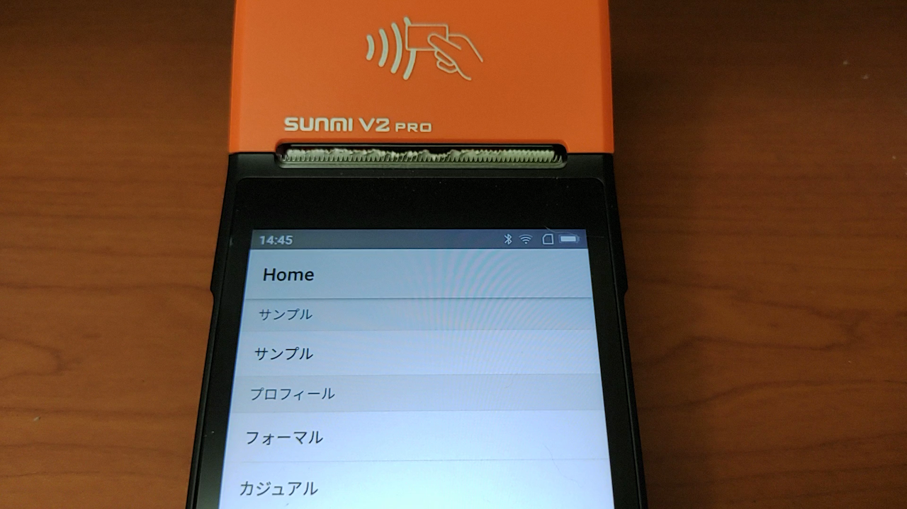
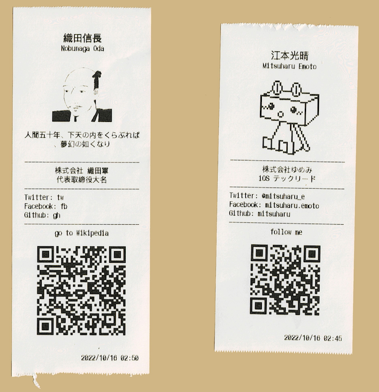

モバイル印刷 for SUNMI V2 PRO / V2s
==

業務用端末 SUNMI V2 PRO / V2s を使用したレシート型名刺などを印刷するアプリです。

## Demo

[](https://www.youtube.com/watch?v=s9HNWSZ2Gbo)


### 印刷結果



## 機能

- 汎用印刷
	- テキスト
	- 画像
	- QRコード
	- NFC解析
- プロフィール印刷
	- 名刺

## Develop

### requirements

- GMSが有効な SUNMI V2 PRO または SUNMI V2s [^requirements-others]

[^requirements-others]: 作者未確認ですが V2 や V1s でも動作するようです

### frameworks

- React Native 0.74.3

### architectures

- Redux Saga

### build

```shell
yarn
yarn android
```

### release

- apk
	- `android/app/build/outputs/apk/release/app-release.apk`
	- 開発版向け

```shell
cd ./android
./gradlew assembleRelease
```

- aab
	- `android/app/build/outputs/bundle/release/app-release.aab`
	- ストアリリース向け（予定なし）

```shell
cd ./android
./gradlew bundleRelease
```

## Features

- 印刷データはアプリ内で追加・編集できます
  - UI は鮮麗されていません
- 画像は端末内のライブラリから選択可能です
  - 事前に白黒加工をするのがおすすめです
 
## その他

- ビルド済みアプリは Releases にて apk を公開しています
- データ構造はバージョンにより修正・変更されます。開発版のため、データのマイグレーション処理はしていません。アンインストールしてから、インストールしてください。

## TODO

- CI
- ストアでの公開？

## License

MIT

## Link

- [業務用スマホ SUNMI V2 PRO の開発準備の手引き - Qiita](https://qiita.com/mitsuharu_e/items/3f2add415136005da719)

