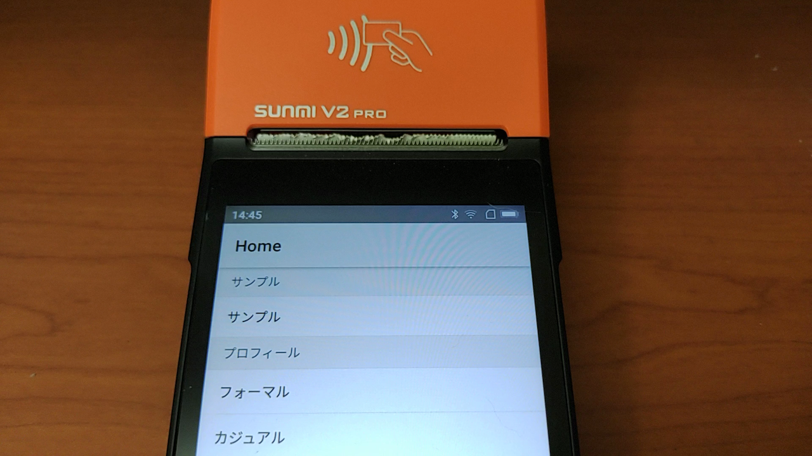
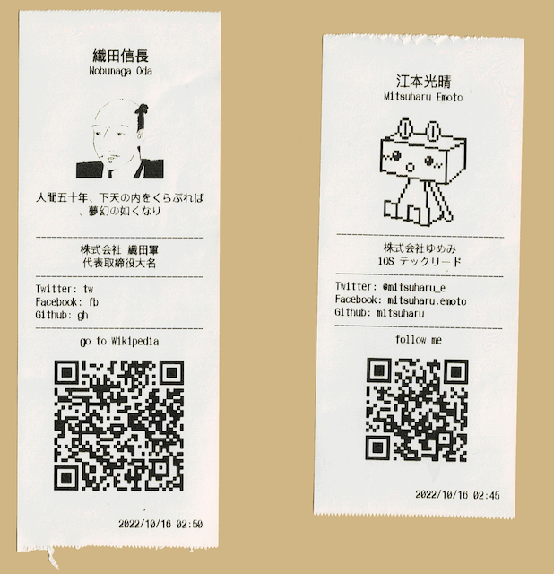

# モバイル印刷 for SUNMI V2 PRO / V2s

業務用端末 SUNMI V2 PRO / V2s を使用したレシート型名刺などを印刷するアプリです。

## Demo

[](https://www.youtube.com/watch?v=s9HNWSZ2Gbo)

### 印刷結果



## 機能

- 汎用印刷
  - テキスト
  - 画像
  - QRコード
  - NFC解析
- レイアウト印刷
  - 印刷する内容をユーザーが組み立てられます
  - 初期状態では名刺のレイアウトが用意されています

## Develop

### requirements

- GMSが有効な SUNMI V2 PRO または SUNMI V2s [^requirements-others]

[^requirements-others]: 作者未確認ですが V2 や V1s でも動作するようです

### frameworks

- React Native 0.79.2

### architectures

- Redux Saga
- SQLite（レイアウトと印刷データの保存）

### build

```shell
yarn
yarn android
```

### lint and format

BiomeでJavaScript、TypeScript、JSONなどの対応ファイルを検査・整形します。

```shell
yarn lint
yarn lint-force
```

### release

- apk
  - `android/app/build/outputs/apk/release/app-release.apk`
  - 開発版向け

```shell
cd ./android
./gradlew assembleRelease
```

- aab
  - `android/app/build/outputs/bundle/release/app-release.aab`
  - ストアリリース向け（予定なし）

```shell
cd ./android
./gradlew bundleRelease
```

### CI

- PR を作成すると、Android apk (debug) のビルドが実行されます
- リリースタグをつけて push すると、リリースビルドが作られて、リリース処理および DeployGate に apk がアップロードされます
  - タグ名に `-` を含めると（`v1.2.0-beta.1` など）プレリリースとして公開します
- GitHub Actions の Publish は手動実行（workflow_dispatch）もできます
  - タグ名を入れると GitHub Releases を作ります。空のままなら DeployGate への配布と、実行結果からの apk ダウンロードのみです
  - プレリリースにするかどうかを選べます（既定はリリース）
- リリースビルドもコミット済みの `debug.keystore` で署名します。ストア配布を想定していない野良アプリのためです

## レイアウト印刷

印刷する内容を **レイアウト** と **印刷データ** に分けて管理します。

- **レイアウト** は印刷の体裁です。テキスト・画像・QRコード・列・区切り線・空白・印刷時刻の要素を並べて組み立てます。要素はドラッグで並べ替えられ、文字の大きさや寄せなどを個別に設定できます。
- **入力項目** はレイアウトのうち、印刷データごとに内容を変えたい箇所です。要素の「内容の決め方」で「印刷データごとに入力する」を選ぶと、入力項目を参照できます。
- **印刷データ** は入力項目へ入れる値です。1つのレイアウトに複数の印刷データを紐付けられるので、同じ体裁で内容だけを変えて印刷できます。

レイアウトは複製・変更・削除でき、編集中に印刷イメージを確認できます。

- 画像は端末内のライブラリから選択可能です
  - 事前に白黒加工をするのがおすすめです
- UI は洗練されていません

設計と実装の経緯は [`docs/plans/custom-layout-printing.md`](docs/plans/custom-layout-printing.md) にまとめています。

## その他

- ビルド済みアプリは Releases にて apk を公開しています
- データ構造はバージョンにより修正・変更されます。開発版のため、データのマイグレーション処理はしていません。アンインストールしてから、インストールしてください。
- レイアウトと印刷データは SQLite に保存します。スキーマの変更は `src/database/migrations/` に追加します。

## TODO

- CI
- ストアでの公開？

## License

MIT

## Link

- [業務用スマホ SUNMI V2 PRO の開発準備の手引き - Qiita](https://qiita.com/mitsuharu_e/items/3f2add415136005da719)
