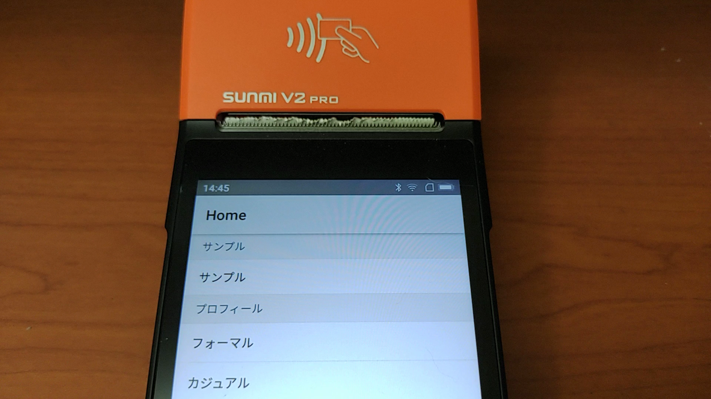
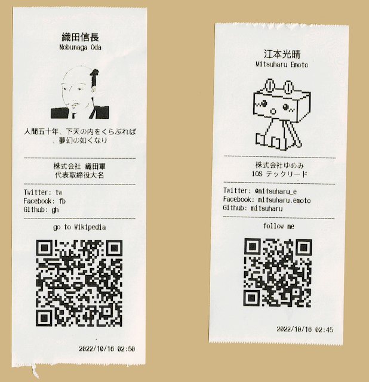

# Mobile Print for SUNMI V2 PRO / V2s

To enable USB debugging, follow the instructions in this repository: [sunmi-v2s-adb-bypass](https://github.com/xRedan/sunmi-v2s-adb-bypass)

An Android application for printing receipt-style business cards and custom documents using commercial **SUNMI V2 PRO / V2s** terminals.

*[日本語のドキュメントはこちら (Japanese README)](README-ja.md)*

---

> **Note on the English Edition**  
> This version translates the entire user interface (menus, accessibility labels, dialogs, error messages, and in-app guide) into English. The launcher label is **Mobile Print**. The two bundled preset layouts (*Business card* and *Business card (simple)*), their field labels, record titles, and sample data have also been localized.  
> Existing databases are automatically updated via migration 3 to localize default strings while safely preserving any user-customized labels or values.

---

## Demo

[](https://www.youtube.com/watch?v=s9HNWSZ2Gbo)

### Print Sample



## Features

- **Quick / General Printing**
  - Text
  - Image (black-and-white or grayscale)
  - QR Code
  - NFC analysis
- **Layout Printing**
  - Flexible layout builder allowing users to assemble custom receipt formats
  - Built-in business card preset layouts ready to use out of the box

## Layout Printing Concepts

Content to be printed is separated into **Layouts** and **Print Data (Records)**:

- **Layout**: Defines the visual appearance and structure of the printout. You assemble elements such as text, images, QR codes, columns, horizontal dividers, blank lines, and print timestamps. Elements can be reordered by dragging, and individual settings such as font size and alignment can be configured.
- **Input Fields**: Dynamic placeholders within a layout whose content varies per print record (e.g. name, avatar, title). By choosing "Input field" as the content source for an element, you link it to a specific field.
- **Print Data (Records)**: The actual values entered into the input fields. Multiple print records can be associated with a single layout, allowing you to print different content using the exact same format.

Layouts can be duplicated, edited, and deleted, with an in-app print preview available during editing.

For detailed screen-by-screen walkthroughs, see the [English user guide](docs/usage.md) (also accessible inside the app from **Home (i) → About this app → User guide**).

Design background and implementation details are documented in [`docs/plans/custom-layout-printing.md`](docs/plans/custom-layout-printing.md).

## Development

### Requirements

- SUNMI V2 PRO or SUNMI V2s with Google Play Services (GMS) enabled [^requirements-others]
- Node 24, Yarn 4.9.1 (included via `.yarn/releases/`), JDK 17, and Android SDK/NDK as defined in `android/build.gradle`

[^requirements-others]: Not officially verified by the original author, but reported to work on SUNMI V2 and V1s as well.

### Frameworks & Architecture

- **React Native 0.79.2**
- **Redux Saga**
- **SQLite** (storage for layouts, fields, and print data records)

### Build & Run

Install dependencies and start the Android development build:

```shell
node .yarn/releases/yarn-4.9.1.cjs install --immutable
yarn android
```

### Lint, Format & Tests

Code formatting and static analysis are managed with Biome:

```shell
yarn lint
yarn lint-force
yarn typecheck
TZ=Asia/Tokyo yarn test --runInBand
```

### Release

- **APK** (Development / local release):
  - Output: `android/app/build/outputs/apk/release/app-release.apk`

  ```shell
  cd android
  ./gradlew assembleRelease
  ```

- **AAB** (Google Play bundle format, not intended for store release):
  - Output: `android/app/build/outputs/bundle/release/app-release.aab`

  ```shell
  cd android
  ./gradlew bundleRelease
  ```

### Packaging Notes for the English Edition

For the locally packaged English release, the production JavaScript is bundled with Metro and compiled with the pinned Hermes compiler. Unchanged Android native code, libraries, and resources from the upstream 1.0.2 release are reused; only the JS bundle and launcher label string (`strings.xml`) are updated. The APK is aligned and signed with the committed `debug.keystore`.

The original release APK remains available for rollback using `adb install -r` without uninstalling the app.

### CI & Distribution

- Opening a Pull Request triggers an Android debug APK build.
- Pushing a release tag triggers a release build, creating GitHub Releases and uploading the APK to DeployGate (tags with hyphens such as `v1.2.0-beta.1` are treated as pre-releases).
- The `Publish` GitHub Actions workflow can also be triggered manually (`workflow_dispatch`).
- Release builds are signed using `debug.keystore` by design, as the application is distributed as a standalone package rather than through Google Play.

## Database & Migrations

- Layouts and print data are stored in an embedded SQLite database.
- Schema changes and data migrations are managed in `src/database/migrations/`.
- Migration `003_english_presets.ts` handles updating default preset strings for existing installations without overwriting user customizations.

## License

[MIT](LICENSE)

## Upstream Links & Attribution

- Original Author: [Mitsuharu Emoto](https://github.com/mitsuharu)
- Original Upstream Repository: [mitsuharu/mobile-printer](https://github.com/mitsuharu/mobile-printer)
- [SUNMI V2 PRO Development Setup Guide (Japanese) - Qiita](https://qiita.com/mitsuharu_e/items/3f2add415136005da719)
