# 使い方

SUNMI端末のプリンターで印刷するアプリです。この文書は 1.0.0 時点の画面をもとにしています。

アプリ内でも同じ内容を読めます。ホーム右上の (i) から「このアプリについて」→「このアプリの使い方」です。

## 目次

- [印刷のしかたは2通りあります](#印刷のしかたは2通りあります)
- [レイアウト印刷の3つの言葉](#レイアウト印刷の3つの言葉)
- [印刷する](#印刷する)
- [レイアウトを作る](#レイアウトを作る)
- [要素を並べる](#要素を並べる)
- [内容の決め方](#内容の決め方)
- [入力項目](#入力項目)
- [印刷データを入れる](#印刷データを入れる)
- [印刷イメージで確かめる](#印刷イメージで確かめる)
- [このアプリについて](#このアプリについて)

## 印刷のしかたは2通りあります

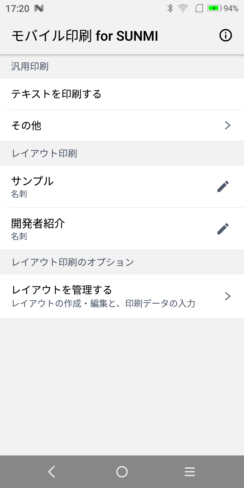

**汎用印刷** は、入力したテキストや選んだ画像をその場で印刷します。体裁は決まっていて、手早く1枚出したいときに向きます。「テキストを印刷する」のほか、「その他」から画像・QRコード・NFCタグの複製ができます。

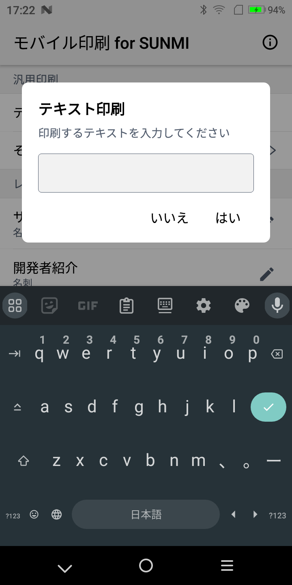

**レイアウト印刷** は、あらかじめ作った体裁へ内容を流し込んで印刷します。名刺のように、同じ体裁で内容だけを変えたいときに使います。

## レイアウト印刷の3つの言葉

| 言葉 | 意味 |
| --- | --- |
| レイアウト | 印刷の体裁。テキスト・画像・QRコード・列・区切り線・空白・印刷時刻を並べて組み立てます |
| 入力項目 | レイアウトのうち、印刷データごとに内容を変えたい箇所。名前やアイコン画像など |
| 印刷データ | 入力項目へ実際に入れた内容のひとまとまり。1つのレイアウトに何件でも作れます |

初回起動時に、名刺レイアウトと、その印刷データ（サンプル・開発者紹介）が入っています。

## 印刷する

ホームの「レイアウト印刷」に印刷データが並びます。タップするとそのまま印刷します。右の鉛筆から、入力した内容を直せます。

印刷するたびにレイアウトをたどらなくて済むよう、印刷と編集の両方をホームから届く位置に置いています。

## レイアウトを作る

ホームの「レイアウトを管理する」へ進みます。

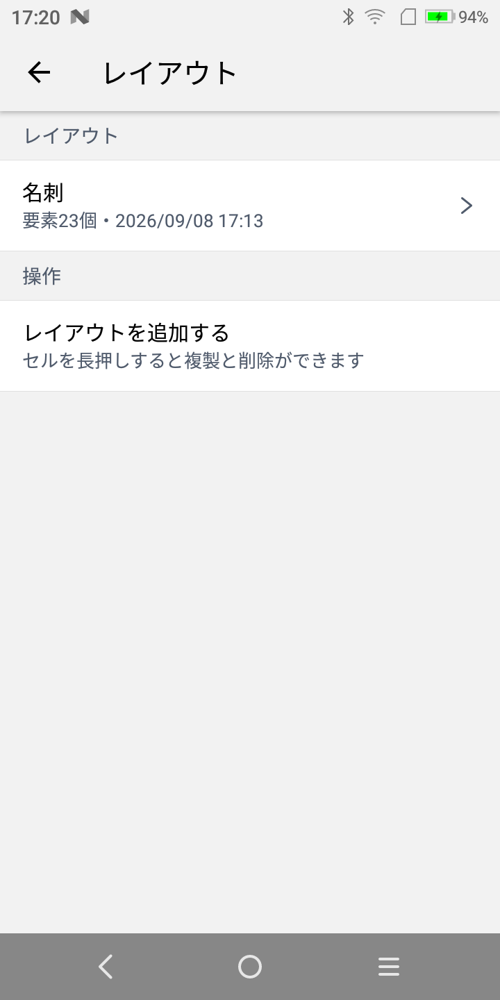

「レイアウトを追加する」で新しく作ります。一覧のセルを長押しすると、複製と削除ができます。既存のレイアウトを複製して手を入れるのが手軽です。

## 要素を並べる

レイアウトを開くと、印刷する順に要素が並びます。

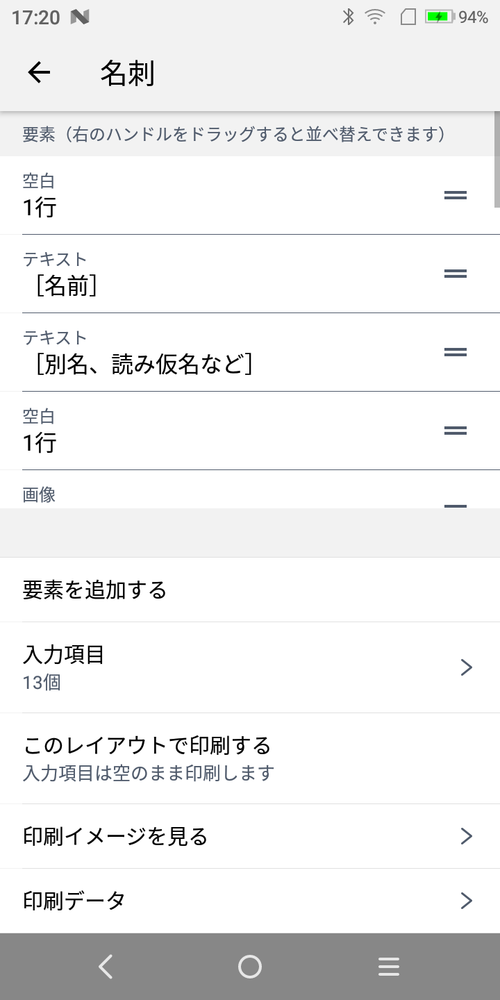

右のハンドルをドラッグすると順番を変えられます。「要素を追加する」で足せる要素は次のとおりです。

| 要素 | 印刷されるもの |
| --- | --- |
| テキスト | 文字。大きさ・寄せ・太字・下線を選べます |
| 画像 | 端末内のライブラリから選んだ画像。白黒かグレースケールを選べます |
| QRコード | 文字列を変換したQRコード |
| 列 | ラベルと値のように、1行を左右に分けて並べたもの |
| 区切り線 | 用紙幅いっぱいの線。線の種類を選べます |
| 空白 | 指定した行数の空行 |
| 印刷時刻 | 印刷した日時。書式を指定できます |

要素をタップすると体裁を変えられます。

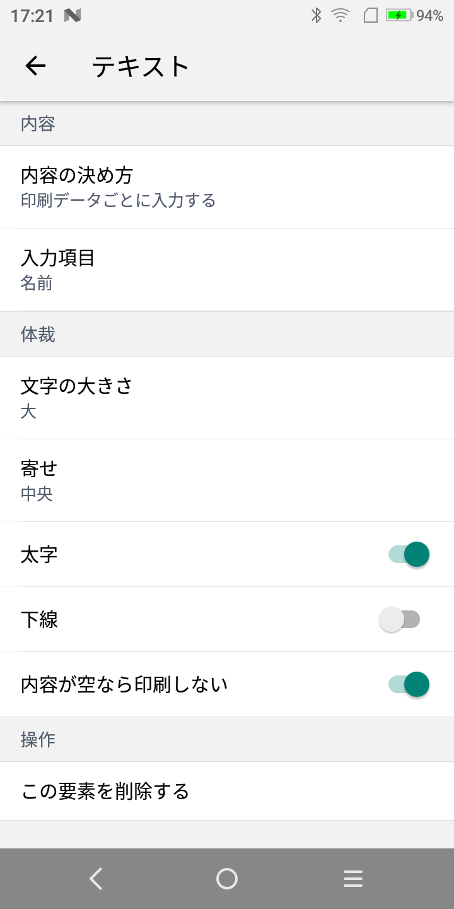

「内容が空なら印刷しない」を入にしておくと、値を入れなかった項目は行ごと出ません。項目の有無で紙の長さを変えたいときに使います。

## 内容の決め方

要素には「決まった内容をそのまま印刷する」か「印刷データごとに入力する」かを選べます。

前者は、どの印刷データでも同じ文字を出したいとき（見出しやラベルなど）に使います。後者を選ぶと、どの入力項目を使うかを指定します。

## 入力項目

レイアウトの画面の「入力項目」から、表示名・キー・入力の種類を編集できます。

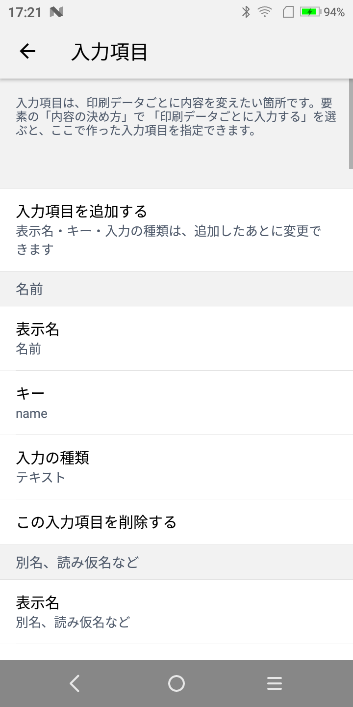

要素の入力項目を選ぶ一覧の末尾からも追加できます。要素を作る流れの途中で項目が足りないと気付いたとき、画面を戻らずに済みます。

入力の種類は、テキスト・複数行テキスト・URL・画像から選びます。印刷データの入力欄がこれに合わせて変わります。

## 印刷データを入れる

レイアウトの画面の「印刷データ」へ進みます。

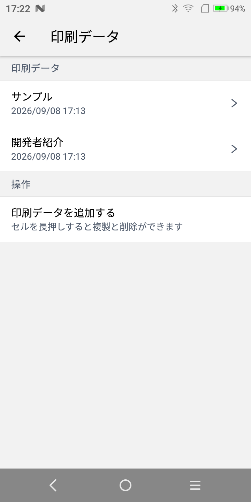

印刷データを開くと、入力項目が並びます。

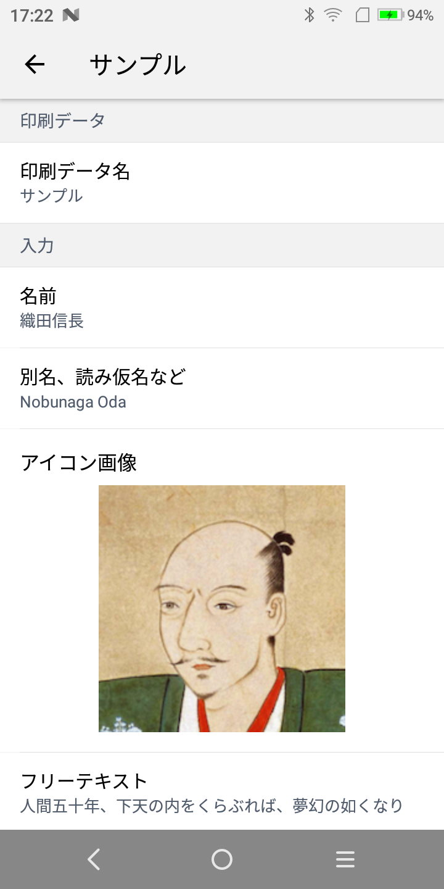

印刷データ名は、ホームの一覧に出る名前です。ここで入れた内容は、同じレイアウトを使うほかの印刷データには影響しません。

## 印刷イメージで確かめる

レイアウトの画面の「印刷イメージを見る」で、紙に出す前におおよその見た目を確認できます。

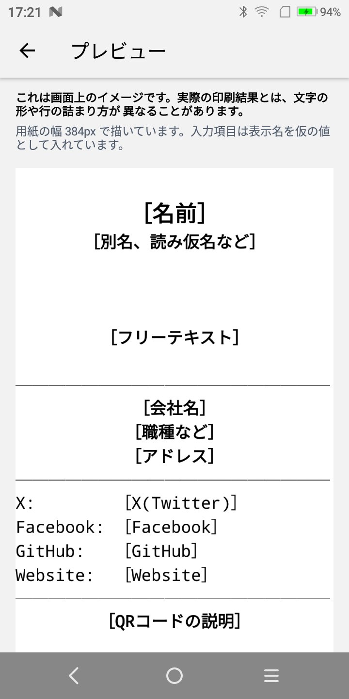

これは画面上のイメージです。実際の印刷結果とは、文字の形や行の詰まり方が異なることがあります。用紙幅にあたる 384px で描いています。

## このアプリについて

ホーム右上の (i) から開きます。

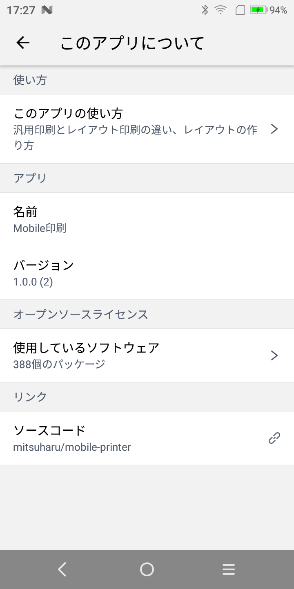

使い方、アプリのバージョン、同梱しているOSSのライセンス、ソースコードへのリンクが並びます。

「このアプリの使い方」は、この文書と同じ内容をアプリの中で読めるようにしたものです。

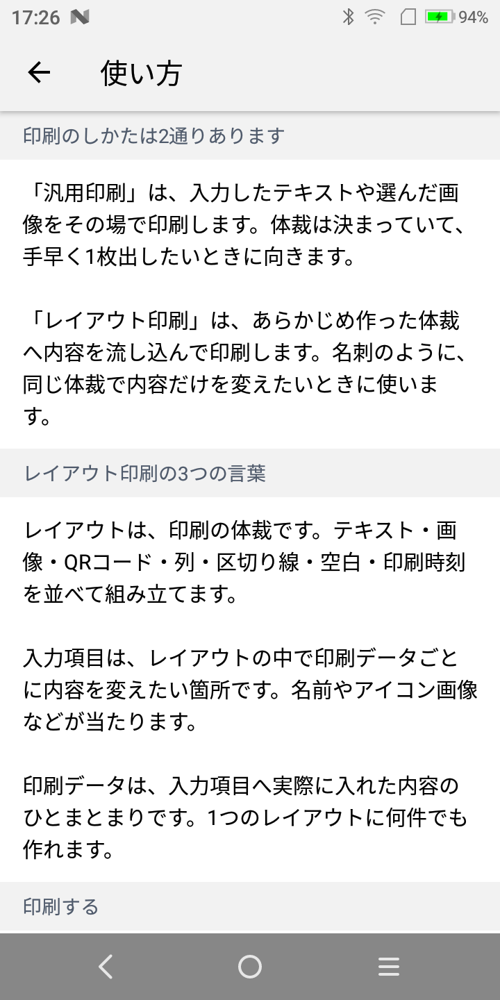
